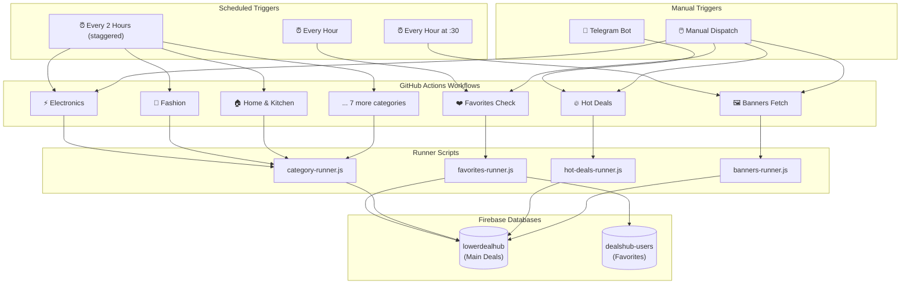

# GitHub Actions Architecture

## Overview

This repository uses GitHub Actions for automated, scheduled data collection and processing. The workflows are designed to run independently in parallel without interfering with each other.

## Architecture Diagram



## Workflow Categories

### 1. Favorites Check (favorites-check.yml)
- **Schedule**: Every hour (configurable to 30 min)
- **Purpose**: Match user favorites with current deals, send Telegram notifications
- **Runtime**: ~5-10 minutes
- **Data flow**: Read favorites from dealshub-users DB → Compare with deals in lowerdealhub → Send Telegram notifications

### 2. Category Product Scrapers (category-*.yml)
- **Schedule**: Every 2 hours, staggered by 5 minutes
- **Purpose**: Scrape product listings from Amazon for each category
- **Runtime**: ~10-15 minutes per category
- **Parallelism**: All 10 categories run independently
- **Categories**: Electronics, Fashion, Home & Kitchen, Sports & Fitness, Beauty, Automotive, Baby & Kids, Grocery, Books & Stationery, Deals & Trending

### 3. Hot Deals (hot-deals-telegram.yml)
- **Trigger**: workflow_dispatch (API call from Telegram bot)
- **Purpose**: Process a specific deal URL, scrape details, store in DB
- **Runtime**: ~3-5 minutes
- **Flow**: Telegram message → Private repo bot → GitHub API workflow_dispatch → Process deal → DB

### 4. Banners Fetch (banners-fetch.yml)
- **Schedule**: Every hour at :30
- **Purpose**: Scrape promotional banners from e-commerce homepages
- **Runtime**: ~10-15 minutes
- **Platforms**: Amazon, Flipkart, Myntra, Ajio

## Minutes Estimation

| Workflow | Frequency | Est. Minutes/Run | Daily Runs | Daily Minutes |
|----------|-----------|-------------------|------------|---------------|
| Favorites | Hourly | 10 | 24 | 240 |
| Category ×10 | Every 2h | 15 | 12×10=120 | 1,800 |
| Hot Deals | On-demand | 5 | ~10 | 50 |
| Banners | Hourly | 15 | 24 | 360 |
| **Total** | | | | **~2,450** |

> Since this is a **public repository**, GitHub Actions minutes are **unlimited**.

## Concurrency

Each workflow uses a concurrency group to prevent duplicate runs:
- If a new run starts while a previous one is still running, the previous one is cancelled
- Category workflows each have their own group, so they never cancel each other

## Secrets Management

See [SECRETS_REFERENCE.md](.github/SECRETS_REFERENCE.md) for details on required GitHub Secrets.

## File Structure

```
.github/
  workflows/
    favorites-check.yml
    category-electronics.yml
    category-fashion.yml
    category-home-kitchen.yml
    category-sports-fitness.yml
    category-beauty.yml
    category-automotive.yml
    category-baby-kids.yml
    category-grocery.yml
    category-books-stationery.yml
    category-deals-trending.yml
    hot-deals-telegram.yml
    banners-fetch.yml
  SECRETS_REFERENCE.md
actions/
  setup-firebase.js
  favorites-runner.js
  category-runner.js
  hot-deals-runner.js
  banners-runner.js
```
